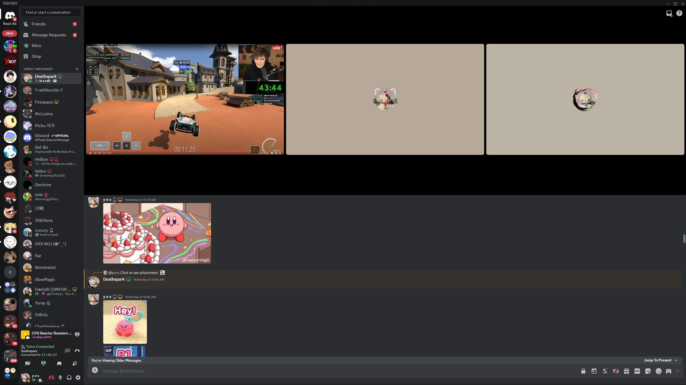

# pre2025cord (WIP)

A theme for Discord that brings the pre-2025 UI back without removing features

###### this does not work with BetterFolders plugin at the moment



# Installation

## [Vencord](https://github.com/Vendicated/Vencord)

Paste the following in `Settings > Themes > Edit QuickCSS`:

```css
@import url("https://raw.githubusercontent.com/yes-0001/pre2025cord/refs/heads/main/src/main.css");
/* @import url("https://raw.githubusercontent.com/yes-0001/pre2025cord/refs/heads/main/src/addons/hide_camerabutton.css"); */

/*  

    MAKE SURE TO CHECK GITHUB FOR :ROOT UPDATES
    if you use a theme, make sure to change the values to fit your needs, as these values work best with default theme

*/

:root {
	--current-version: "v1.1";
	
	/*  opacity for version text on topbar, keep this slightly visible so you know when you need to check for :root changes  */
	--version-opactiy: 2%;

	/*  transparency values [0-100%], allows for use with a background image (0% means it's see-through, 100% means it's not at all see-through)  */
	--transparency_call:                    80%;  /*  discord call background  */
	--transparency_title:                   0%;  /*  title (the thing above chat in servers, and the thing above the call bg in dms)  */
	--transparency_chat:                    12%;
	--transparency_channeltext:             0%;
	--transparency_bg:                      0%;
	--transparency_topbar:                  60%;
	--transparency_guildsList:              60%;  /*  server list  */
	--transparency_sidebarList:             30%;  /*  channel/dm list  */
	--transparency_searchbar-left:          40%;  /*  search bar on the top left above your dms  */
	--transparency_searchbar-right:         40%;  /*  search bar on the top right  */
	--transparency_panels:                  40%;  /*  bottom left voice/user info  */
	--transparency_panels_streaming:        0%;  /*  bottom left streaming info when streaming  */
	--transparency_settings-sidebar:        30%;  /*  left sidebar of settings  */
	--transparency_settings-content:        20%;  /*  right side content of settings  */
	--transparency_modal-main:              30%;  /*  modal background (screenshare modal and others)  */
	--transparency_modal-footer:            20%;  /*  modal footer (screenshare modal and others)  */
	
	/*  gradient values for guildslist, looks best on transparent backgrounds  */
	--gradient_guildsList_point1:           94.2%;
	--gradient_guildsList_point2:           96%;

	/*  borders, original discord look is all 0px, looks best on 1px for some themes  */
	--call_border-bottom:                   0px;
	--title_border-top:                     0px;
	--sidebarList_border-right:             0px;
	--sidebarList_border-left:              0px;
	--sidebarList_border-top:               0px;
	--sidebarList_border-top-left-radius:   0px; /*  if transparency_topbar > 0% then 0px, if transparency_topbar is 0% then you can do 16px  */
	--panels_border-left:                   0px;
	--panels_border-top:                    0px;

	/*  others  */
	--border_colors:                      rgba(75, 75, 75, 0.5);
	--pill_padding:                         0px; /*  the white stuff to the left of guilds showing you: where you currently are, and what servers have unread messages  */
	--server_padding:                       -4px; /*  padding for guild icons, change if they're too far left or right  */
}


```

## [Join the Discord to give suggestions and complaints](https://discord.com/invite/klecakes)